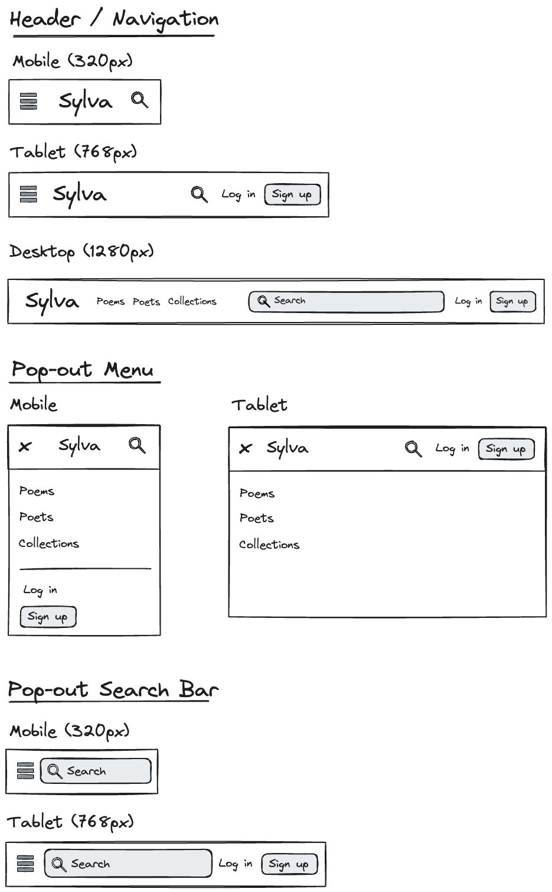
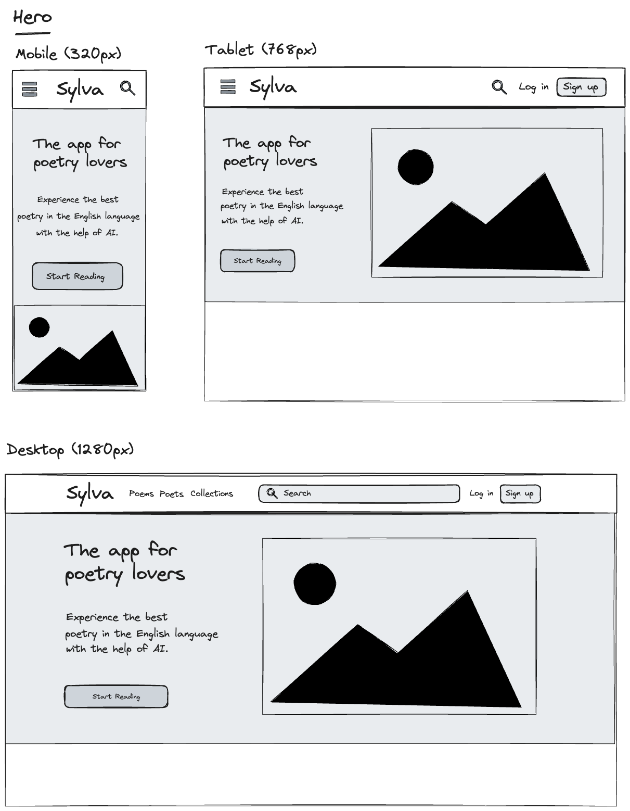

# Project Title

_CloseReader_

## Overview

_CloseReader_ is an app for reading and learning about poetry with the help of generative AI.

### Problem

Almost all the poetry that students read in English literature programs can be found online for free, but very few readers take advantage of its availability. One barrier is the poor user experience offered by the websites that host these texts; another is that the interpretive guidance readers need is largely restricted to those who can afford post-secondary education. The internet has democratized access to poetry, but not the means to read and understand it. My project tries to bridge this gap by providing a visually appealing and illuminating environment for anyone who wants to explore the poetic tradition.

### User Profile

- General readers:
  - Curious about the poetic tradition, but don’t know where to start
  - Looking for a clean, well-designed reading environment that looks good on mobile devices
  - Want help understanding and interpreting what they’re reading

### Features

- As a user, I want to be able to view poems sorted by author
- As a user, I want to be able to search for poems by author and/or title
- As a user, I want to click on a poem and see it displayed in a reader-friendly view
- As a user, I want to have access to curated collections of poems
- As a user viewing a poem I want to click on a button that will display AI-generated analysis to help me understand the text
- As as user, I want to be able to create an account
- As a logged-in user, I want to b e able to curate collections of poems that other users can access
- As a logged-in user, I want to be able to “like” my favourite collections
- As a logged-in user, I want to be able to “like” my favourite poems and see them in a favorites list
- As a logged-in user, I want to be to to “unlike” poems and remove them from my favorites list

## Implementation

### Tech Stack

#### Build/Development

- Vite

#### Runtime Environment

- Node

#### Frameworks and Libraries

- React
- React Router
- Tailwind
- Radix
- Framer Motion
- Axios
- Express

### APIs

- _CloseReader_ will use two external APIs to retrieve and generate content:
  - For poetry: [PoetryDB](https://github.com/thundercomb/poetrydb)
  - For analysis: [OpenAI API](https://platform.openai.com/)
- _CloseReader_ will also have its own server and databse for storing usernames, passwords, a user's favourites list, and curated collections of poems

### Sitemap

- Home Page
- Browse Poets Page
- Poetry Collections Page
- Individual Poet Page
- Poem Page
- User's Favorite Poems Page
- Register/Login

### Mockups

- Note: mockups not yet complete. Also, first drafts were done with a different working title for the app (_Sylva_), but there's already an educational app with that name

#### Header Navigation



#### Home Page with Hero



### Endpoints: PoetryDB

**GET https://poetrydb.org/title/:poemTitle/**

- Gets a single poem by title

Parameters:

- Input field: `title`
- Search term: title, or part of the title, of a poem
- Example request: `https://poetrydb.org/title/Ozymandias`

Response:

```json
[
  {
    "title": "Ozymandias",
    "author": "Percy Bysshe Shelley",
    "lines": [
      "I met a traveller from an antique land",
      "Who said: Two vast and trunkless legs of stone",
      "Stand in the desert...Near them, on the sand,",
      "Half sunk, a shattered visage lies, whose frown,",
      "And wrinkled lip, and sneer of cold command,",
      "Tell that its sculptor well those passions read",
      "Which yet survive, stamped on these lifeless things,",
      "The hand that mocked them, and the heart that fed:",
      "And on the pedestal these words appear:",
      "'My name is Ozymandias, king of kings:",
      "Look on my works, ye Mighty, and despair!'",
      "Nothing beside remains. Round the decay",
      "Of that colossal wreck, boundless and bare",
      "The lone and level sands stretch far away."
    ],
    "linecount": "14"
  }
]
```

**GET https://poetrydb.org/author/:authorName**

- Get all poems by a single author

Parameters:

- Input field: `author`
- Search term: name, or part of the name, of the author
- Example request: `https://poetrydb.org/author/Keats`

Response:

```json
[
  {
    "title": "Happy Is England! I Could Be Content",
    "author": "John Keats",
    "lines": [
      // Lines
    ],
    "linecount": "14"
  },
  {
    "title": "To Hope",
    "author": "John Keats",
    "lines": [
      // Lines
    ],
    "linecount": "48"
  },
  {
    "title": "To My Brothers",
    "author": "John Keats",
    "lines": [
      // Lines
    ],
    "linecount": "14"
  }
  // More poems here
]
```

**GET https://poetrydb.org/author**

- Get all authors
- Input field: `author`
- Example request:

Response:

```json
{
  "authors": [
    "Adam Lindsay Gordon",
    "Alan Seeger",
    "Alexander Pope",
    "Algernon Charles Swinburne",
    // Etc, etc ...
    "William Shakespeare",
    "William Topaz McGonagall",
    "William Vaughn Moody",
    "William Wordsworth"
  ]
}
```

### Endpoint: OpenAI API

**POST https://api.openai.com//v1/chat/completions**

- Posts the title of poem to mode with accompanying prompt and returns generated response

Parameters:

- `model`: id of the language model to use (e.g, `gpt-4`, `gpt-3.5-turbo` )
- `messages`: An array of message objects containing preliminary prompt, the user's
  messages, and the model's responses
- `temperature`: ranges from 0 to 2, with 2 resulting in more diverse and creative resuls
- `max_tokens`: Maximum number of tokens that can be generated (100 tokens ~= 75 words )

Example Request:

```json
{
  "model": "gpt-3.5-turbo",
  "messages": [
    {
      "role": "system",
      "content": "You are poetry expert. When you receive a poem title, please generate a short interpretive analysis that will help a reader understand what the poem is about, any interesting things to pay attention to, and situate the poem in its historical or biographical context. "
    },
    {
      "role": "user",
      "content": "Ozymandias by Percy Bysse Shelley"
    }
  ],
  "temperature": 0.7,
  "max_tokens": 200
}
```

Response:

```json
{
  "id": "chatcmpl-8kMGXWP6DiChc5DJwRsYPbc8TtTqH",
  "object": "chat.completion",
  "created": 1706059369,
  "model": "gpt-3.5-turbo-0613",
  "choices": [
    {
      "index": 0,
      "message": {
        "role": "assistant",
        "content": "\"Ozymandias\" by Percy Bysshe Shelley is a sonnet that explores the transient nature of power and the inevitable decay of all human achievements. The poem takes its name from the Greek name for the Egyptian pharaoh Ramses II, known as Ozymandias. Through vivid language and imagery, Shelley presents a scene of a fallen statue in the desert, depicting the remains of a once-great ruler.\n\nThe poem begins with a traveler recounting his encounter with a colossal statue, which lies shattered and eroded in the vast desert. The remnants of the statue serve as a metaphor for the fleeting nature of power and the eventual insignificance of even the mightiest rulers. The inscription on the statue's pedestal reads: \"My name is Ozymandias, King of Kings; / Look on my Works, ye Mighty, and despair!\" This inscription, once a testament to the pharaoh's grandeur, now serves to highlight the irony of his self-proclaimed invincibility"
      },
      "logprobs": null,
      "finish_reason": "length"
    }
  ],
  "usage": {
    "prompt_tokens": 74,
    "completion_tokens": 200,
    "total_tokens": 274
  },
  "system_fingerprint": null
}
```

### Endpoints: Server

**POST /users/signup**

- Add a user account

Parameters:

- email: User's email
- password: User's provided password

Response:

```json
{
  "token": "seyJhbGciOiJIUzI1NiIsInR5cCI6IkpXVCJ9.eyJzdWIiOiIxMjM0NTY3ODkwIiwibmFtZSI6I..."
}
```

**POST /users/login**

- Login a user

Parameters:

- `email`: User's email
- `password`: User's provided password

Response:

```json
{
  "token": "seyJhbGciOiJIUzI1NiIsInR5cCI6IkpXVCJ9.eyJzdWIiOiIxMjM0NTY3ODkwIiwibmFtZSI6I..."
}
```

**POST /:userName/favorites**
**GET /:userName/favorites**

- Post: When a user clicks the "like" button on a poem, posts the poem to a list of their favorites
- Get: When a user navigates to their Favorites Page, returns a l

Request (POST)

```json
[
  {
    "title": "Happy Is England! I Could Be Content",
    "author": "John Keats",
    "lines": [
      // Lines
    ],
    "linecount": "14"
  }
]
```

Response (POST & GET)

```json
[{
  "title": "Happy Is England! I Could Be Content",
  "author": "John Keats",
  "lines": [
      // Lines
    ],
  "linecount": "14",
}
{
"title": "Ozymandias",
"author": "Percy Bysshe Shelley",
"lines": [
      // Lines
    ],
"linecount": "14"
}
{
"title": "Sonnet 1 - From Fairest Creatures We Desire Increase",
"author": "Shakespeare",
"lines": [
      // Lines
    ],
"linecount": "14"
}
]


```

## Roadmap

### Frontend

- Set up: create react app with routes and pages

- Feature: Home Page

  - Component: Header with navigation menu, search, login/signup
  - Compoenent: Footer

- Feature: Browse Poets Page

  - PoetryDB GET requests to fetch all authors
  - Render list with response data
  - Clicking on navigates to Author Page

- Feature: Author Page

  - Render list of all available poems by selected author
  - Clicking on poem links to Poem Page

- Feature: Poem Page

  - Create responsive reading environment to render poem lines
  - Component: AI analysis button

- Feature: Search Results Page

  - Create list of poems returned by searching for title or author

- Feature: Signup/Login Page

  - Create login form front-end functionality

- Feature: Poetry Collections Page

  - Create cards showing "playlists" for poems grouped by author, topic, century, etc.

- Feature: User's Favorite Poems Page
  - Create table of poems "liked" by user

### Backend

- Set up: create node express server with routes

- Set up: create database using Knex and MySQL

- Feature: Login/Register

  - Create functionality and connect to front-end

- Feature: Favorites

  - Create table/ to store for user's "liked" poems

- Feature: Collections

  - Create table of collections with titles of included poems

- Feature: Implement JWT tokens

  - Server: Update expected requests / responses on protected endpoints
  - Client: Store JWT in local storage, include JWT on axios calls

- Testing

- Demo Day

## Nice-to-haves

- Images and biographical summaries for author pages
- Personalized and shareable collections
- Ability to save and refresh analyses
- Rankings for mosted liked poems, authors, and collections
